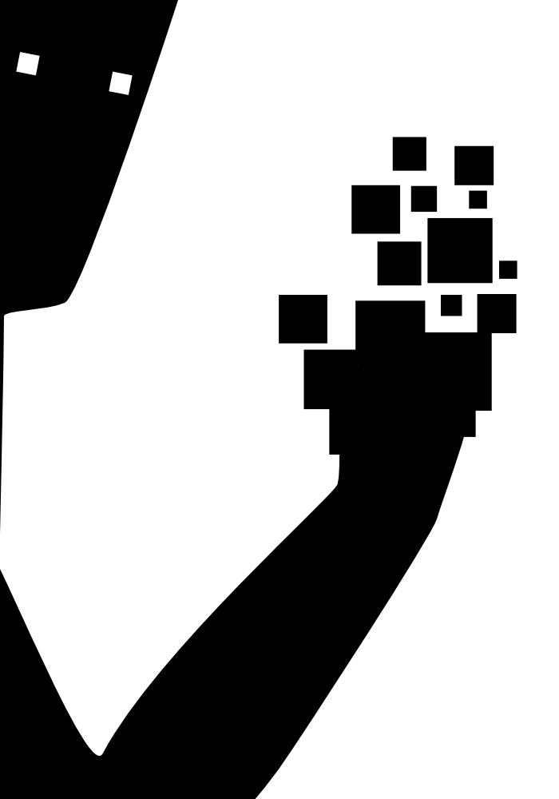

# Shape

Shape was my daily art journal from July 2006 to August 2007 (Ages 15–17).

I started the project to deepen my ability to draw vectors without tracing.

Shape remains one of my most beloved things I've ever made.

